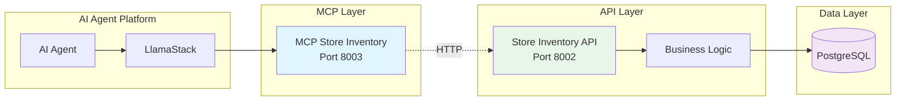
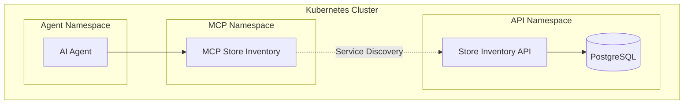

# MCP Store Inventory

A lightweight, standalone Model Context Protocol (MCP) server that connects to an external store inventory API. This server provides AI agents with inventory management capabilities while maintaining architectural flexibility through API separation.

## Overview

MCP Store Inventory is a client-only MCP server that communicates with an external store API. It offers maximum flexibility by decoupling the MCP protocol layer from the data layer, enabling independent scaling and deployment.

## Architecture



**Port Information:**
- **Container Ports**: 8003 (MCP Server), 8002 (Store API)
- **Local Development**: 8001 (MCP Server), 8002 (Store API)
- **Kubernetes**: 8003 (MCP Server), 8002 (Store API)

## Features

### 🚀 **Lightweight Design**
- **Minimal Dependencies**: Only HTTP client and MCP protocol
- **Stateless Operation**: No local data storage
- **Fast Startup**: Quick initialization and deployment
- **Resource Efficient**: Low memory and CPU footprint

### 🔧 **Flexible Integration**
- **API Agnostic**: Works with any compatible REST API
- **Configurable Endpoints**: Environment-based API configuration
- **Health Monitoring**: Built-in health checks
- **Error Handling**: Robust error propagation and handling

## Quick Start

### Prerequisites
- Running Store Inventory API (see [store-inventory](../store-inventory/))
- Python 3.12+

### Local Development
```bash
# Navigate to directory
cd mcpservers/mcp-store-inventory

# Create virtual environment
python -m venv .venv
source .venv/bin/activate  # On Windows: .venv\Scripts\activate

# Install dependencies
pip install -r requirements.txt

# Start the database (uncomment store-inventory and mcp-store-inventory services in ../compose.yaml for full setup)
podman compose -f ../compose.yaml up -d postgresql

# Start Store Inventory API first (in another terminal)
cd ../store-inventory
uvicorn main:app --port 8002 --reload

# Configure API endpoint
export STORE_API_URL="http://localhost:8002"

# Run the MCP server
python server.py

# Test the connection
curl http://localhost:8001/health  # MCP Server (local port 8001)
curl http://localhost:8002/health  # Test API connectivity (local port 8002)
```

### Podman Deployment
```bash
# Build container
podman build -t mcp-store-inventory .

# Run with API connection
podman run -p 8003:8003 \
  -e STORE_API_URL="http://store-api:8002" \
  mcp-store-inventory
```

### Kubernetes Deployment
```bash
# Deploy with Helm (configure critical options)
helm install mcp-inventory ./helm \
  --set env.STORE_API_URL="http://store-inventory:8002" \
  --set image.repository=quay.io/ecosystem-appeng/mcp-store-inventory \
  --set image.tag=latest

# Check status
kubectl get pods -l app.kubernetes.io/name=mcp-store-inventory

# Test from cluster (port forward and curl)
kubectl port-forward svc/mcp-store-inventory 8003:8003 &
curl http://localhost:8003/health  # Kubernetes port-forward
```

## Available Tools

All tools are proxied to the configured Store Inventory API:

| Tool | Description | API Endpoint |
|------|-------------|--------------|
| `get_products` | List all products | `GET /products/` |
| `get_product_by_id` | Get product by ID | `GET /products/id/{id}` |
| `get_product_by_name` | Get product by name | `GET /products/name/{name}` |
| `search_products` | Search products | `GET /products/search/` |
| `add_product` | Create new product | `POST /products/` |
| `remove_product` | Delete product | `DELETE /products/{id}` |
| `order_product` | Place order | `POST /orders/` |

## Configuration

### Environment Variables
```bash
# Required: Store API endpoint
STORE_API_URL="http://store-inventory-api:8002"

# Optional: Server settings
MCP_PORT=8003
LOG_LEVEL=INFO
TIMEOUT_SECONDS=30
```

### API Compatibility
This server expects the connected API to provide:
- Standard REST endpoints for product operations
- JSON request/response format
- HTTP status codes for error handling
- Compatible data models

## Documentation

- **[Development Guide](DEVGUIDE.md)** - Setup and development
- **[User Guide](USERGUIDE.md)** - Usage examples and configuration

## Use Cases

### ✅ **Best For**
- Microservices architectures
- Independent scaling requirements
- Multi-environment deployments
- API-first development
- Cloud-native applications
- Separation of concerns

### ⚠️ **Consider Alternatives When**
- Simple, monolithic deployment is preferred (use mcp_dbstore)
- Direct database access is needed
- Minimal network hops are critical
- Single-team development

## Deployment Patterns

### **Microservices Pattern**


### **Multi-Environment Setup**
- **Development**: Local API connection
- **Staging**: Staging API with test data
- **Production**: Production API with load balancing

## Performance

- **Throughput**: ~500 requests/second (limited by API)
- **Latency**: API latency + ~2ms overhead
- **Memory Usage**: ~30MB base
- **Startup Time**: <2 seconds
- **Network**: Efficient HTTP connection pooling

## Monitoring

### Health Checks
- **MCP Health**: `/health` endpoint returns server status
- **API Connectivity**: Validates connection to Store API
- **Response Times**: Tracks API call performance

### Observability
```bash
# Check MCP server health
curl http://localhost:8001/health  # Local development (port 8001)

# Monitor API connectivity
curl http://localhost:8001/health | jq '.store_api_status'
```

## Error Handling

The server provides intelligent error handling:
- **API Unavailable**: Returns clear error messages
- **Network Timeouts**: Configurable timeout handling
- **HTTP Errors**: Proper status code propagation
- **Data Validation**: Client-side validation where possible

## Integration Examples

### With Store Inventory API
```bash
# Start Store Inventory API first
cd ../store-inventory
uvicorn main:app --port 8002

# Then start MCP server
cd ../mcp-store-inventory
STORE_API_URL="http://localhost:8002" python server.py
```

### With External APIs
```bash
# Connect to remote API
STORE_API_URL="https://api.example.com/inventory" python server.py

# With authentication (if API requires it)
STORE_API_URL="https://api.example.com/inventory" \
API_KEY="your-key" \
python server.py
```

## Support

For technical support and development:
- Review the [Development Guide](DEVGUIDE.md)
- Check the [User Guide](USERGUIDE.md) for usage examples
- Ensure [Store Inventory API](../store-inventory/) is running
- See the main [MCP Servers documentation](../README.md)
